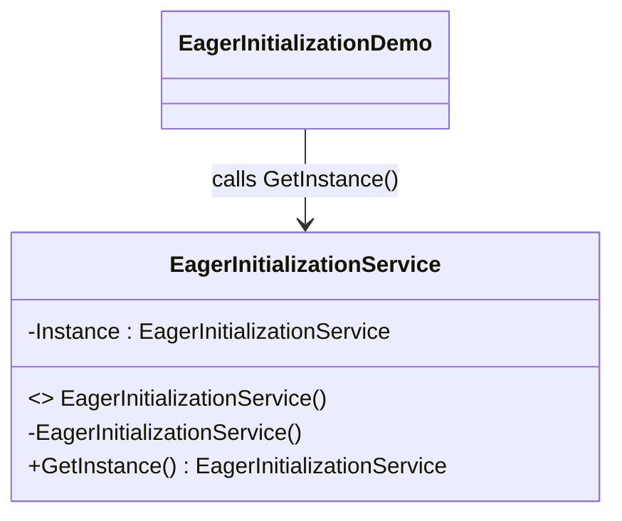

# 05 - Eager Initialization

This subtype creates the singleton instance at type load time and returns it through a static accessor.

---

## 1. Intent

Prefer startup-time creation for maximum simplicity and predictable instance availability.

---

## 2. Core Classes in This Subtype

- EagerInitializationService
- EagerInitializationDemo

### Roles

- EagerInitializationService: allocates instance in static readonly field and exposes GetInstance.
- EagerInitializationDemo: verifies that all calls receive the same shared instance.

---

## 3. Thread-Safety Behavior

- Thread safe through CLR static initialization guarantees.
- No locks are required in access path.
- Instance always exists once type initialization completes.

---

## 4. Trade-Offs

- Pros: simplest runtime access path and deterministic lifetime start.
- Pros: no lazy initialization branching or lock cost.
- Cons: instance is created even when not used.
- Cons: startup or type-load cost may increase for expensive services.

---

## 5. How It Differs from Other Singleton Variants

- Compared to Basic Singleton: same static-instance style, but explicitly documented as eager strategy.
- Compared to ThreadSafeLock: no lazy behavior and no lock path.
- Compared to DoubleCheckedLocking: no conditional synchronization complexity.
- Compared to LazyInitialization: opposite creation timing, upfront instead of on first use.

---

## 6. Code Explanation

```csharp
public sealed class EagerInitializationService
{
	private static readonly EagerInitializationService Instance = new();

	static EagerInitializationService() { }

	private EagerInitializationService() { }

	public static EagerInitializationService GetInstance() => Instance;
}
```

Explanation:

- Instance is created during type initialization, before first explicit use.
- Static constructor controls type initialization semantics.
- private constructor prevents external instantiation.
- GetInstance always returns the same already-created object.

---

## 7. UML Diagram



---

## Summary

Use this subtype when early allocation is acceptable and you want minimal concurrency complexity.
