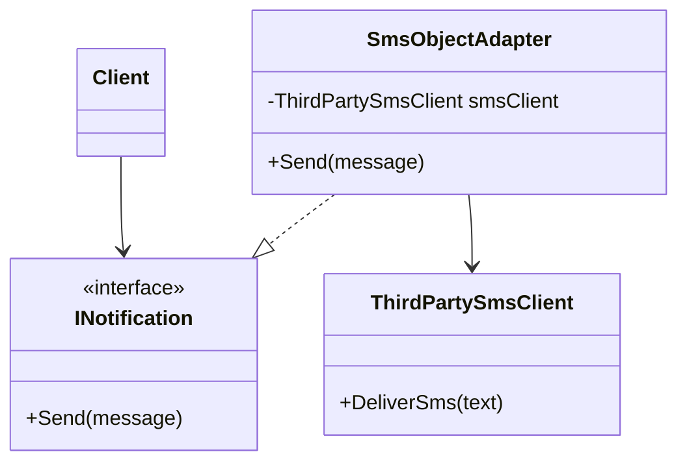

# Adapter

This solution demonstrates how to make incompatible interfaces work together without changing existing client code or legacy components.

## 1. Intro

The Adapter pattern is a structural design pattern that converts one interface into another interface the client expects.

### Definition

Adapter lets the client work through a target abstraction while internally delegating calls to an adaptee with a different interface.

Instead of rewriting legacy services or changing client code to match legacy contracts, the client talks to a clean target interface and the adapter handles the translation.

## 2. Core Components of the Design Pattern

| Pattern Role | Responsibility | Example from this solution |
| --- | --- | --- |
| Target | Interface expected by the client | `IAlertPublisher`, `INotificationPort` |
| Adaptee | Existing interface/class with incompatible contract | `LegacyAlertWriter`, `ILegacyNotifier` / `LegacyNotifier` |
| Adapter | Bridges target calls to adaptee behavior | `ClassAdapterPublisher`, `ObjectAdapterNotifier` |
| Client | Uses only the target abstraction | Demo methods in each `PatternDemo.cs` |

### How the current code implements this pattern

- The client chooses a target interface (`IAlertPublisher` or `INotificationPort`).
- The adapter translates target calls into adaptee calls.
- The adaptee remains unchanged.
- The client remains independent from legacy interface details.

## 3. Sub Types of Adapter in this Solution

### 01 - Class Adapter

The adapter inherits from the adaptee and implements the target interface.

- Uses inheritance to reuse adaptee behavior.
- `ClassAdapterPublisher` extends `LegacyAlertWriter` and exposes `Publish`.

### 02 - Object Adapter

The adapter wraps an adaptee instance and implements the target interface.

- Uses composition to delegate work.
- `ObjectAdapterNotifier` accepts `ILegacyNotifier` and exposes `Notify`.

## 4. How These Variants Differ from Each Other

| Variant | Adaptation style | Best learning point |
| --- | --- | --- |
| Class Adapter | Inheritance (`Adapter : Adaptee`) | Quick reuse, tightly coupled to one adaptee type |
| Object Adapter | Composition (`Adapter has Adaptee`) | More flexible, easier swapping/testing of adaptees |

### Difference summary

- Class Adapter focuses on extending legacy behavior through inheritance.
- Object Adapter focuses on wrapping and forwarding via composition.

## 5. Which SOLID Principles Are Applied

### SRP - Single Responsibility Principle

Adapters handle interface translation. Adaptees keep their original behavior.

### OCP - Open/Closed Principle

You can add new adapters for new targets or adaptees without changing existing client workflows.

### DIP - Dependency Inversion Principle

Client code depends on target abstractions (`IAlertPublisher`, `INotificationPort`) rather than concrete legacy classes.

### LSP - Liskov Substitution Principle

Any adapter implementing the same target interface can replace another without breaking client usage.

## 6. UML Diagram

Add UML here to show:



## 7. Types - Subtype Examples One by One

### Example 1: Class Adapter

```csharp
IAlertPublisher publisher = new ClassAdapterPublisher();
var alert = publisher.Publish("Payment settled");
```

What happens:

- The client calls only `IAlertPublisher.Publish`.
- `ClassAdapterPublisher` maps that call to legacy behavior (`WriteLegacy`).
- The result is formatted through the legacy implementation.

### Example 2: Object Adapter

```csharp
INotificationPort port = new ObjectAdapterNotifier(new LegacyNotifier(), "orders.created");
var notification = port.Notify("{ \"id\": 42 }");
```

What happens:

- The client calls only `INotificationPort.Notify`.
- `ObjectAdapterNotifier` forwards to `ILegacyNotifier.SendLegacy(topic, payload)`.
- The adaptee contract stays unchanged while the client uses the target contract.

## How to Validate That This Implementation Is Correct

You can validate the Adapter implementation using this checklist:

- The client should call only target interface methods.
- The adapter should forward data correctly to the adaptee.
- Error handling and edge cases from the adaptee should be translated clearly.
- Replacing one adapter with another should not require client code changes.

### Practical validation steps

1. Call the system only through the target interface (`IAlertPublisher` or `INotificationPort`).
2. Verify forwarded values (category/topic/payload) match expectations at the adaptee boundary.
3. Test edge inputs (empty, whitespace, special characters) and adaptee failures.
4. Swap adapters with another implementation of the same target interface and verify client code stays unchanged.

If these checks pass, the implementation correctly demonstrates Adapter.

## Summary

The current implementation demonstrates Adapter by placing a translation layer between client-friendly target interfaces and legacy contracts. Both class-based and object-based variants show how to preserve existing behavior while keeping client code clean and decoupled.
