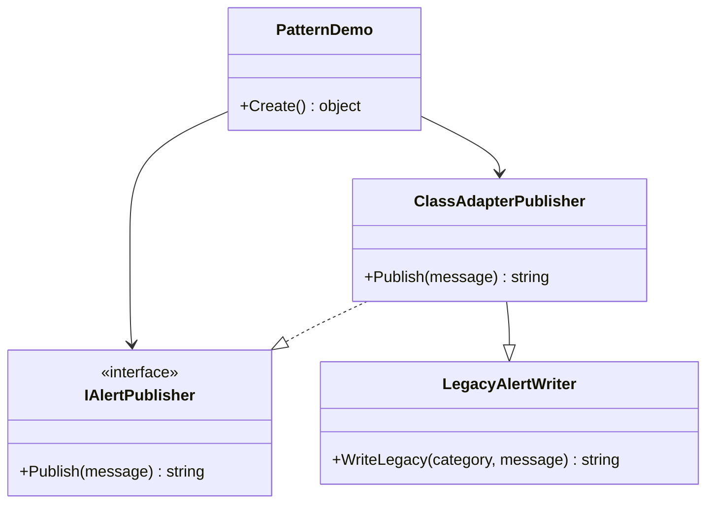

# 01-ClassAdapter

This variant demonstrates the Adapter pattern using inheritance.

## Intent

Expose a modern publishing contract while reusing a legacy alert writer API.

## Type Roles In This Code

- Target: IAlertPublisher
- Adaptee: LegacyAlertWriter
- Adapter: ClassAdapterPublisher
- Client entry: PatternDemo.Create()

## Code Explanation

The client code in PatternDemo requests an IAlertPublisher and assigns a ClassAdapterPublisher instance.

ClassAdapterPublisher inherits LegacyAlertWriter and implements IAlertPublisher. Its Publish method forwards the request to the inherited WriteLegacy method with a fixed category value of "application".

Flow:
1. Client calls Publish("Payment settled") on IAlertPublisher.
2. ClassAdapterPublisher.Publish executes.
3. Inherited LegacyAlertWriter.WriteLegacy("application", message) runs.
4. The adapted output is returned as [APPLICATION] Payment settled.

## When To Choose Which Adapter Variant

Use this quick guideline when deciding between 01-ClassAdapter and 02-ObjectAdapter.

| Decision Point | Choose 01-ClassAdapter | Choose 02-ObjectAdapter |
| --- | --- | --- |
| Core technique | Inheritance is acceptable | Composition is preferred |
| Adaptee shape | Legacy API is a concrete class | Legacy API is interface-based or should be swappable |
| Runtime flexibility | Low (fixed adaptee relationship) | High (inject different adaptee implementations) |
| Dependency injection | Not a strong requirement | Required or strongly preferred |
| Extra adapter state/config | Minimal need | Needs runtime config (for example, topic/route/context) |

### Practical Rules Of Thumb

1. Choose 01-ClassAdapter when you want the simplest bridge and the adaptee is stable.
2. Choose 02-ObjectAdapter when you expect change, extension, or test-time mocking.
3. If your project already follows DI and interface-first design, default to 02-ObjectAdapter.
4. If you need to adapt multiple legacy implementations without rewriting adapter logic, use 02-ObjectAdapter.

## UML



## Run-Time Example

```csharp
IAlertPublisher publisher = new ClassAdapterPublisher();
var alert = publisher.Publish("Payment settled");
```

The adapter keeps client code aligned with IAlertPublisher while reusing the legacy writer implementation through inheritance.
