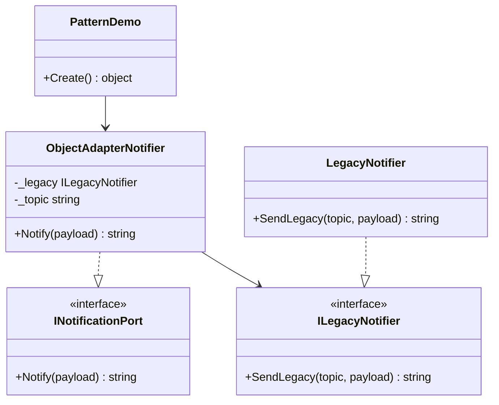

# 02-ObjectAdapter

This variant demonstrates the Adapter pattern using composition.

## Intent

Expose a modern notification port while delegating to a legacy notifier API.

## Type Roles In This Code

- Target: INotificationPort
- Adaptee contract: ILegacyNotifier
- Concrete adaptee: LegacyNotifier
- Adapter: ObjectAdapterNotifier
- Client entry: PatternDemo.Create()

## Code Explanation

The client code in PatternDemo creates an ObjectAdapterNotifier with a LegacyNotifier instance and a topic value.

ObjectAdapterNotifier implements INotificationPort and stores two fields: the adaptee reference (_legacy) and topic (_topic). Its Notify method delegates to _legacy.SendLegacy(_topic, payload).

Flow:
1. Client calls Notify("{ \"id\": 42 }") on ObjectAdapterNotifier.
2. ObjectAdapterNotifier.Notify executes.
3. Delegation call _legacy.SendLegacy(_topic, payload) runs.
4. The adapted output is returned as topic=orders.created; payload={ "id": 42 }.

## UML



## Run-Time Example

```csharp
var adapter = new ObjectAdapterNotifier(new LegacyNotifier(), "orders.created");
var notification = adapter.Notify("{ \"id\": 42 }");
```

The adapter keeps client code aligned with INotificationPort while reusing the legacy notifier through composition.
