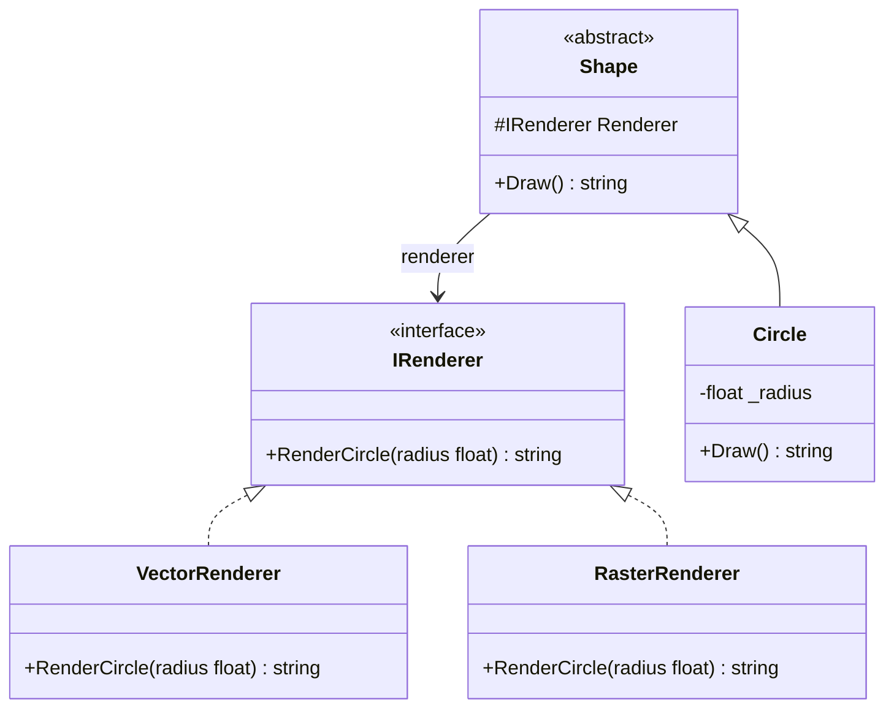

# 01 - AbstractionImplementationSeparation

## What this variant demonstrates

Bridge keeps the abstraction and the implementor on separate axes. `Shape` depends on `IRenderer`, so the abstraction can vary without being tied to one concrete renderer.

### Code focus

```csharp
public interface IRenderer
{
    string RenderCircle(float radius);
}

public abstract class Shape
{
    protected readonly IRenderer Renderer;

    protected Shape(IRenderer renderer) => Renderer = renderer;

    public abstract string Draw();
}

public sealed class Circle : Shape
{
    public override string Draw() => Renderer.RenderCircle(_radius);
}
```

In this variant:
- `Shape` stores the implementor through the `IRenderer` interface, not a concrete renderer class.
- `Circle` stays focused on shape behavior and delegates rendering to the implementor.
- `VectorRenderer` and `RasterRenderer` can be swapped without changing the abstraction hierarchy.

## How it differs from other Bridge variants

- Compared to `02-RefinedAbstractionVsConcreteImplementor`, this variant focuses on the base separation first: one abstraction, one implementor family.
- It is the simplest Bridge shape: adding a new renderer does not require touching `Shape` or `Circle`.
- The composition root is the only place that knows both concrete sides together.

## UML

