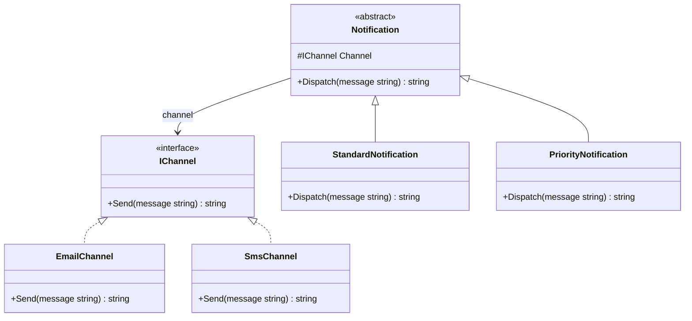

# 02 - RefinedAbstractionVsConcreteImplementor

## What this variant demonstrates

This Bridge variant shows that you can add refined abstractions without changing the implementor family. `Notification` depends on `IChannel`, while `StandardNotification` and `PriorityNotification` add different policies on top.

### Code focus

```csharp
public interface IChannel
{
    string Send(string message);
}

public abstract class Notification
{
    protected readonly IChannel Channel;

    protected Notification(IChannel channel) => Channel = channel;

    public abstract string Dispatch(string message);
}

public sealed class StandardNotification : Notification
{
    public override string Dispatch(string message) => Channel.Send(message);
}

public sealed class PriorityNotification : Notification
{
    public override string Dispatch(string message) => Channel.Send($"[PRIORITY] {message}");
}
```

In this variant:
- `Notification` keeps the implementor behind the `IChannel` interface field.
- `StandardNotification` and `PriorityNotification` are refined abstractions that reuse the same channel API.
- `EmailChannel` and `SmsChannel` remain stable while abstraction behavior grows.

## How it differs from other Bridge variants

- Compared to `01-AbstractionImplementationSeparation`, this variant emphasizes multiple refined abstractions over the same implementor set.
- Adding a new notification style does not require changing `IChannel`, `EmailChannel`, or `SmsChannel`.
- The composition root is the only place that knows both concrete sides.

## UML

