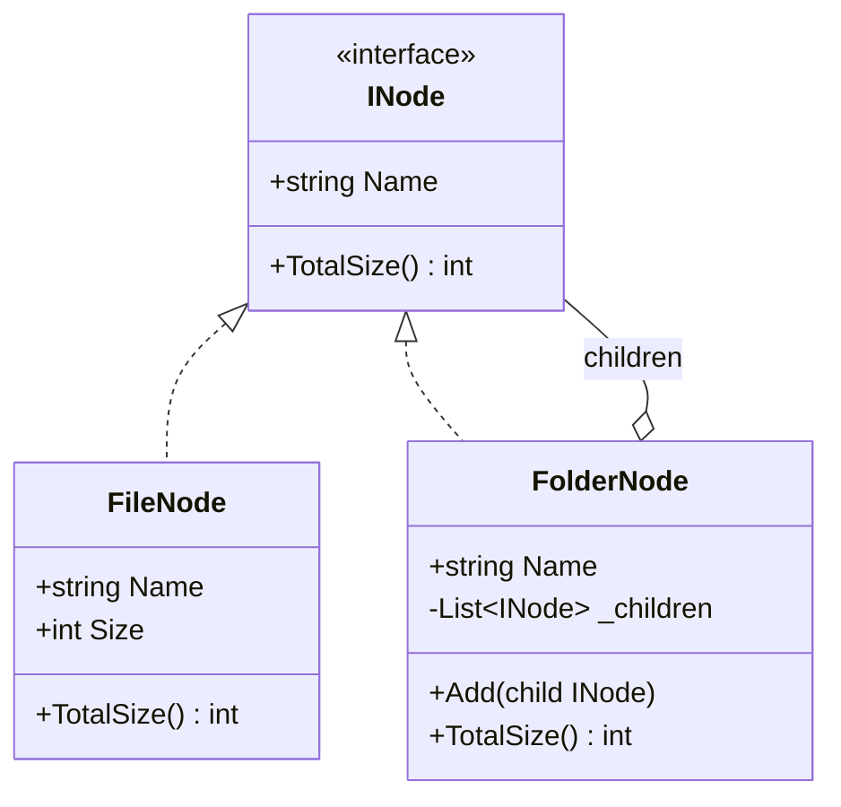

# 01 - SafeComposite

## What this variant demonstrates

Safe Composite keeps child-management operations only on composite types. Leaf nodes expose only domain behavior from the component interface.

### Code focus

```csharp
public interface INode
{
    string Name { get; }
    int TotalSize();
}

public sealed class FileNode : INode
{
    public int TotalSize() => Size;
}

public sealed class FolderNode : INode
{
    public void Add(INode child) => _children.Add(child);
    public int TotalSize() => _children.Sum(child => child.TotalSize());
}
```

In this variant:
- `INode` contains only shared behavior (`TotalSize`).
- `FileNode` has no child-management API, so misuse is impossible at compile time.
- `FolderNode` owns traversal and aggregates recursively.

## How it differs from other Composite variants

- Compared to `02-TransparentComposite`: Safe Composite prevents calling `Add`/`Remove` on leaves because those methods do not exist on the shared interface.
- Trade-off: clients that need to build trees may need explicit knowledge of composite types (`FolderNode`) for composition steps.

## UML

