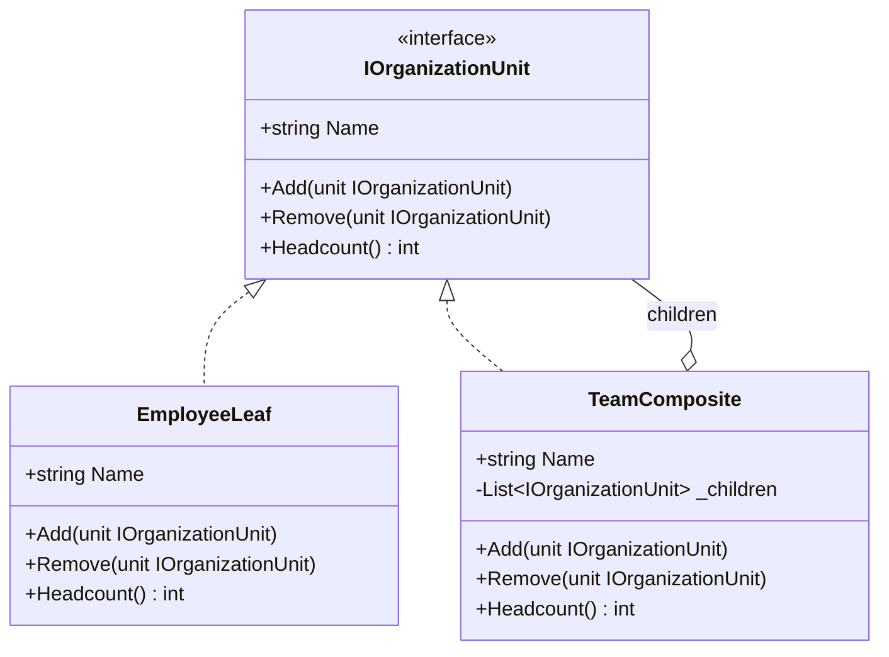

# 02 - TransparentComposite

## What this variant demonstrates

Transparent Composite gives both leaf and composite nodes a uniform interface, including child-management methods.

### Code focus

```csharp
public interface IOrganizationUnit
{
    string Name { get; }
    void Add(IOrganizationUnit unit);
    void Remove(IOrganizationUnit unit);
    int Headcount();
}

public sealed class EmployeeLeaf : IOrganizationUnit
{
    public void Add(IOrganizationUnit unit) => throw new NotSupportedException();
    public void Remove(IOrganizationUnit unit) => throw new NotSupportedException();
    public int Headcount() => 1;
}

public sealed class TeamComposite : IOrganizationUnit
{
    public void Add(IOrganizationUnit unit) => _children.Add(unit);
    public int Headcount() => _children.Sum(child => child.Headcount());
}
```

In this variant:
- clients can treat every node uniformly as `IOrganizationUnit`.
- leaves still satisfy the same interface, but unsupported child operations fail at runtime.
- recursion is handled by `TeamComposite` by delegating to each child.

## How it differs from other Composite variants

- Compared to `01-SafeComposite`: Transparent Composite improves API uniformity for clients, but allows invalid operations on leaves to compile.
- Trade-off: misuse moves from compile-time prevention to runtime validation (`NotSupportedException`).

## UML

