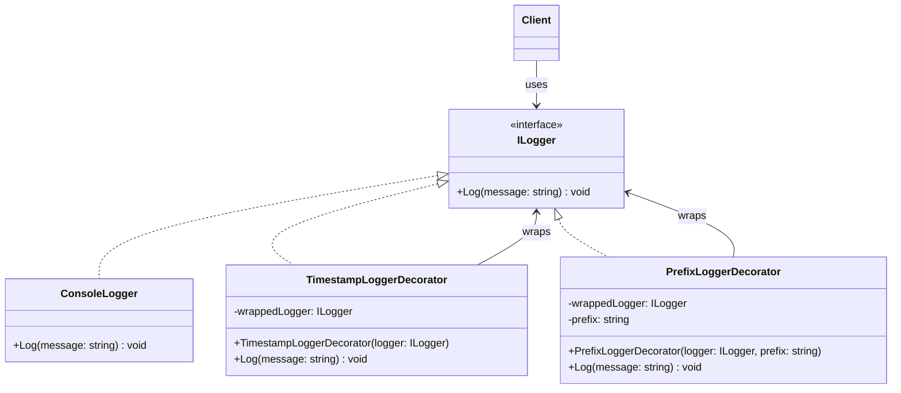

# 01 - Transparent Decorator

## What this variant demonstrates

A **Transparent Decorator** maintains the exact same interface as the component it decorates. The client cannot tell the difference between the original component and a decorated one—the decorator is completely invisible to the caller.

This is the "purest" form of the Decorator pattern, where decorators add behavior while remaining indistinguishable from the component they wrap.

### Code focus

```csharp
// Both ILogger interface implementations look identical to the client
ILogger logger = new ConsoleLogger();
ILogger decoratedLogger = new TimestampLoggerDecorator(logger);

// Client treats both identically—the decorator is transparent
logger.Log("Hello");
decoratedLogger.Log("Hello");  // Adds timestamp, but same interface!
```

In this variant:
- The decorator implements the exact same interface as the component.
- The client has no way to detect that decoration has occurred.
- The decorator forwards all calls to the wrapped component after adding its own behavior.
- This is perfect for cross-cutting concerns like logging, caching, and security checks.

## How it differs from other Decorator variants

- Compared to `02-SemiTransparentDecorator`: Transparent decorators hide their existence completely, while Semi-Transparent decorators expose additional methods for decorator-specific functionality.
- Compared to `03-DynamicVsStaticDecoration`: Transparent is usually applied at construction time and focuses on interface uniformity, while Dynamic/Static is about when and how the decoration is applied.

## UML



## Key Implementation Points

1. **Interface Compliance**: The decorator implements `ILogger` just like the component.
2. **Composition over Inheritance**: The decorator holds a reference to the wrapped component, not inheriting from it.
3. **Transparent Forwarding**: Every method call is forwarded to the wrapped component after adding decorator logic.
4. **Chainable**: Multiple decorators can be stacked, each wrapping the previous one.

## Real-World Example

```csharp
// Without decorators (subclass explosion problem):
// ConsoleLogger, TimestampConsoleLogger, PrefixTimestampConsoleLogger, etc.

// With transparent decorators (clean composition):
ILogger base = new ConsoleLogger();
ILogger withTimestamp = new TimestampLoggerDecorator(base);
ILogger withPrefix = new PrefixLoggerDecorator(withTimestamp, "[APP]");
```

## When to Use Transparent Decorator

- ✅ Adding cross-cutting concerns (logging, caching, security)
- ✅ You want client code to remain unchanged
- ✅ You need to avoid subclass hierarchies
- ✅ The decorator's behavior is an implementation detail
