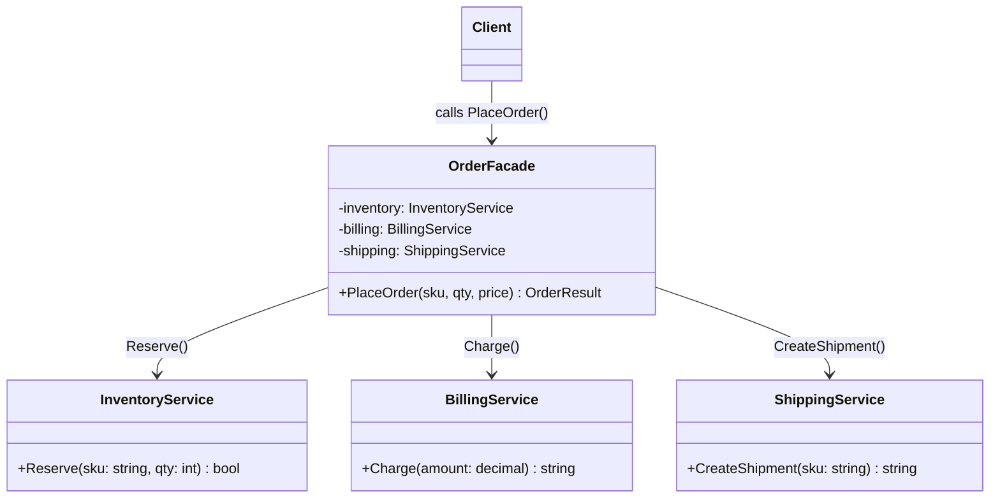

# 01 - Simple Facade

## What this variant demonstrates

A **Simple Facade** provides a single class that wraps several unrelated subsystem services and exposes one or more coarse-grained, task-focused methods. The client calls one method on the facade; the facade decides which services to call, in what order, and how to combine their results.

### Code focus

```csharp
// Without facade — client must know and coordinate three services
var inventory = new InventoryService();
var billing   = new BillingService();
var shipping  = new ShippingService();

bool reserved  = inventory.Reserve("kbd-01", 2);
string payId   = billing.Charge(2 * 49.5m);
string shipId  = shipping.CreateShipment("kbd-01");

// With facade — client calls one method, ignorant of subsystems
var facade = new OrderFacade();
var result = facade.PlaceOrder("kbd-01", 2, 49.5m);
```

In this variant:
- `OrderFacade` owns instances of `InventoryService`, `BillingService`, and `ShippingService`.
- `PlaceOrder` sequences reserve → charge → ship in the correct order.
- The client has zero knowledge of the individual subsystem types.
- Validation failures inside any subsystem surface as a clear facade-level result.

## How it differs from other Facade variants

- Compared to `02-LayeredFacade`: Simple Facade wraps peer subsystems at the same level, while Layered Facade stacks facade-over-facade across architectural tiers.

## UML



## Key Implementation Points

1. **Single entry point**: The client only knows `OrderFacade` — it never imports the subsystem namespaces.
2. **Correct sequencing**: Reserve inventory before charging; charge before creating shipment.
3. **Failure translation**: If `Reserve` returns `false`, the facade stops and returns a failed outcome without charging or shipping.
4. **Subsystem isolation**: Swapping `BillingService` for a different payment provider only touches `OrderFacade`.

## When to Use Simple Facade

- ✅ Three or more services must be coordinated for one user action
- ✅ You want to keep controller or handler code thin
- ✅ You want to unit-test orchestration logic without spinning up real services
- ✅ The subsystem API is low-level or verbose
