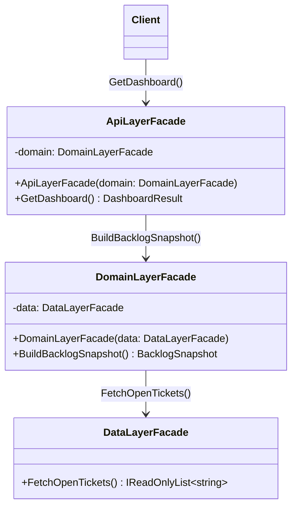

# 02 - Layered Facade

## What this variant demonstrates

A **Layered Facade** applies the Facade pattern across architectural tiers. Each layer exposes a simplified API to the layer above it, and each layer only knows about the layer directly beneath it. The chain typically runs: Data → Domain → API.

This gives you strong separation of concerns: the API layer doesn't know how data is fetched; the domain layer doesn't know how results are presented.

### Code focus

```csharp
// Data layer — wraps raw data access
var data   = new DataLayerFacade();
var tickets = data.FetchOpenTickets();  // ["T-100", "T-204", "T-301"]

// Domain layer — wraps data layer, adds business logic
var domain   = new DomainLayerFacade(data);
var snapshot = domain.BuildBacklogSnapshot();  // { OpenCount: 3, IsHealthy: true }

// API layer — wraps domain layer, formats the response
var api       = new ApiLayerFacade(domain);
var dashboard = api.GetDashboard();  // { Team: "Platform", Snapshot: {...} }

// Client calls only the top-most facade
var result = new ApiLayerFacade(new DomainLayerFacade(new DataLayerFacade())).GetDashboard();
```

In this variant:
- `DataLayerFacade` hides raw data retrieval.
- `DomainLayerFacade` composes `DataLayerFacade` and adds business rules.
- `ApiLayerFacade` composes `DomainLayerFacade` and shapes the final response.
- Each facade depends only on the next lower facade — never on two tiers below.

## How it differs from other Facade variants

- Compared to `01-SimpleFacade`: Simple Facade wraps peer subsystems at one level; Layered Facade stacks facade instances vertically across distinct architectural tiers, where each tier depends only on the one directly below it.

## UML



## Layer Responsibility Table

| Layer | Facade Class | Knows About | Exposes |
|-------|--------------|-------------|---------|
| **Data** | `DataLayerFacade` | Raw storage / repositories | Simple collections |
| **Domain** | `DomainLayerFacade` | `DataLayerFacade` only | Computed business objects |
| **API** | `ApiLayerFacade` | `DomainLayerFacade` only | HTTP-friendly DTOs |

## Key Implementation Points

1. **Strict tier coupling**: `ApiLayerFacade` depends on `DomainLayerFacade`, never on `DataLayerFacade`.
2. **Injected via constructor**: Each facade receives the layer below it through dependency injection, making each independently testable with a stub.
3. **Replaceable tiers**: Swapping the `DataLayerFacade` for a caching variant only changes one constructor call.
4. **Failure propagation**: Each tier translates lower-level failures into tier-appropriate outcomes before passing them up.

## When to Use Layered Facade

- ✅ Your system has distinct horizontal tiers (data / business / presentation)
- ✅ You want to prevent upper layers from reaching past their immediate dependency
- ✅ You need to stub individual tiers in tests without pulling the whole stack
- ✅ You want to evolve tiers independently without cascading changes to clients
