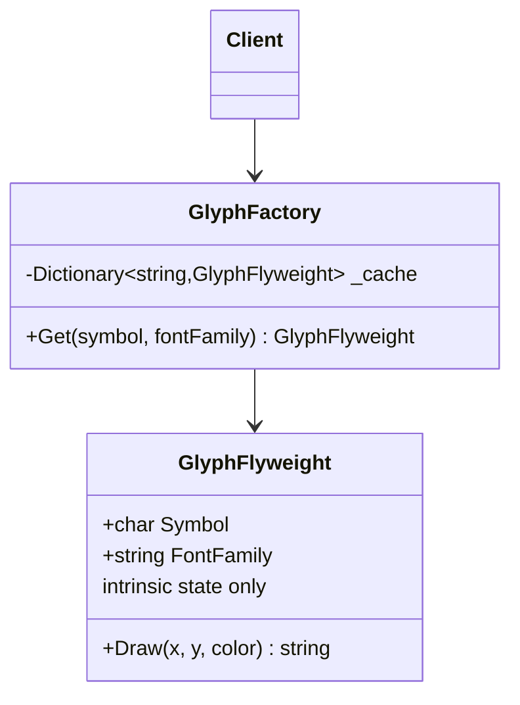

# 01 - IntrinsicVsExtrinsicState

## What this variant demonstrates

This variant separates shared, immutable data (intrinsic state) from context-specific, mutable data (extrinsic state). A factory ensures identical intrinsic states reuse the same flyweight instance.

### Code focus

```csharp
var factory = new GlyphFactory();
var glyph = factory.Get('A', "Consolas");  // intrinsic: symbol + font
var render1 = glyph.Draw(10, 5, "blue");    // extrinsic: position + color
```

In this variant:
- `GlyphFlyweight` stores only intrinsic state: symbol and font family (immutable).
- `GlyphFactory` caches flyweights by intrinsic state key.
- Callers pass extrinsic state (position, color) per request.
- Identical requests reuse the same flyweight instance.

## How it differs from other Flyweight variants

- Compared to `02-CompositeFlyweight`: This variant focuses on basic flyweight sharing; Composite combines multiple flyweights while sharing intrinsic state.
- Both reduce memory by avoiding duplication, but this is simpler and lower-level.

## UML



## Implementation details

1. **Factory pattern integration**: Factory maintains cache, returns existing instances.
2. **Immutability**: Flyweights never store caller-provided context.
3. **Reference equality**: Multiple calls with same intrinsic state return `SameAs` reference.
4. **Memory efficiency**: Shared instances reduce per-object overhead.
