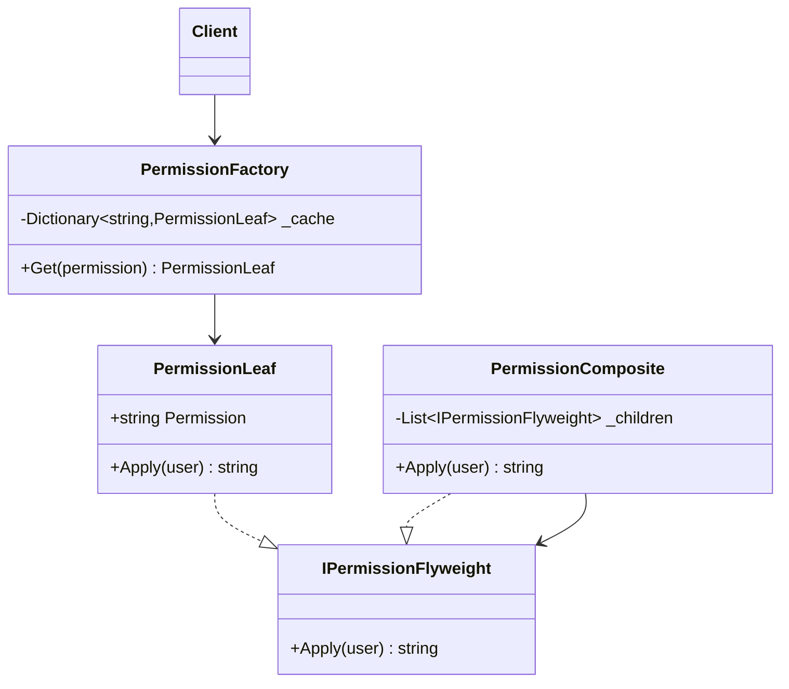

# 02 - CompositeFlyweight

## What this variant demonstrates

This variant combines multiple shared flyweights into composite structures while still leveraging the factory to share intrinsic state. Useful when flyweights themselves need to be composed.

### Code focus

```csharp
var factory = new PermissionFactory();
var composite = new PermissionComposite(new[]
{
    factory.Get("read"),   // shared leaf
    factory.Get("write"),  // shared leaf
    factory.Get("read")    // same instance as first
});
var result = composite.Apply("user");
```

In this variant:
- `PermissionLeaf` stores intrinsic state (permission name).
- `PermissionComposite` holds a collection of flyweights.
- `PermissionFactory` caches and reuses leaf instances.
- Composites remain shallow; intrinsic sharing still happens at leaf level.

## How it differs from other Flyweight variants

- Compared to `01-IntrinsicVsExtrinsicState`: This adds composition; multiple flyweights can be grouped while each still benefits from caching.
- Bridges Flyweight and Composite patterns: reuses shared instances in tree structures.

## UML



## Implementation details

1. **Factory still drives sharing**: Leaves are cached; repeated `Get("read")` returns same instance.
2. **Composite uses interface**: Composites and leaves both implement `IPermissionFlyweight`.
3. **No duplication in collections**: Adding the same permission twice reuses the shared leaf.
4. **Extrinsic context applied at call time**: `Apply(user)` receives context, not stored on flyweight.
