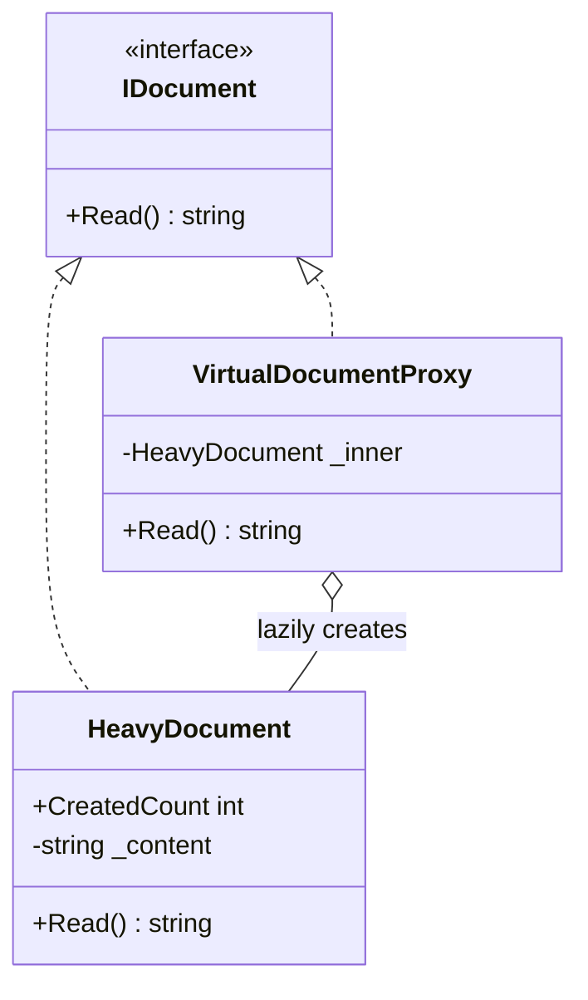

# 01 - Virtual Proxy

## What this variant demonstrates

Virtual Proxy delays creating the real subject until the client actually needs it. The proxy exposes the same abstraction, but it owns lazy initialization.

### Code focus

```csharp
public interface IDocument
{
    string Read();
}

public sealed class HeavyDocument : IDocument
{
    public static int CreatedCount;

    public string Read() => _content;
}

public sealed class VirtualDocumentProxy : IDocument
{
    public string Read()
    {
        _inner ??= new HeavyDocument();
        return _inner.Read();
    }
}
```

In this variant:
- `IDocument` is the single contract the client depends on.
- `VirtualDocumentProxy` defers `HeavyDocument` creation until the first `Read()` call.
- repeated calls reuse the same real object rather than rebuilding it.

## How it differs from other proxy variants

- Compared to `02-RemoteProxy`: Virtual Proxy is about lazy construction, not transport.
- Compared to `03-ProtectionProxy`: Virtual Proxy does not make authorization decisions.
- Compared to `04-SmartProxy`: Virtual Proxy does not add caching or metrics; it only controls object creation.

## UML

