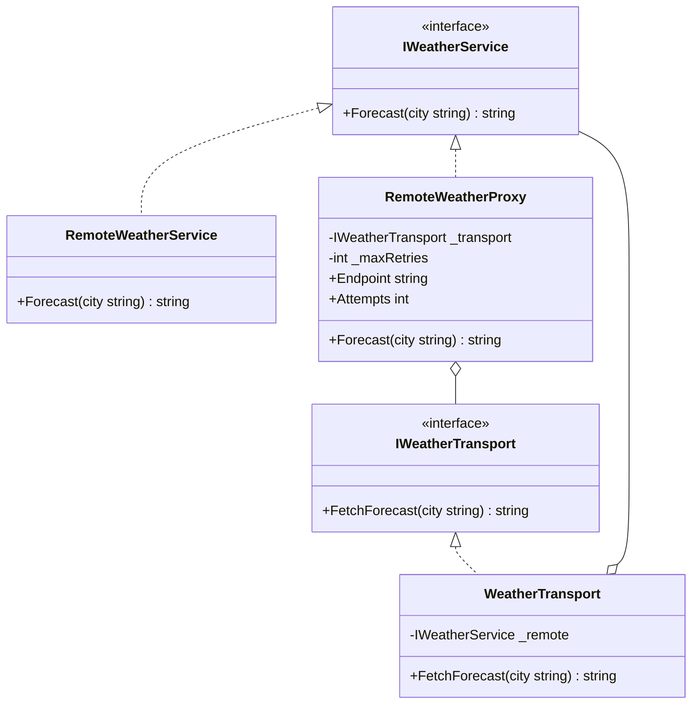

# 02 - Remote Proxy

## What this variant demonstrates

Remote Proxy stands in for an object that lives behind a transport boundary. The proxy keeps the business contract stable while isolating endpoint, retry, and failure handling concerns.

### Code focus

```csharp
public interface IWeatherService
{
    string Forecast(string city);
}

public interface IWeatherTransport
{
    string FetchForecast(string city);
}

public sealed class RemoteWeatherProxy : IWeatherService
{
    public string Forecast(string city)
    {
        return $"[{Endpoint}] {_transport.FetchForecast(city)}";
    }
}
```

In this variant:
- `IWeatherService` remains the client-facing abstraction.
- `RemoteWeatherProxy` controls transport details and optional retries.
- the real weather service stays focused on business output, not network concerns.

## How it differs from other proxy variants

- Compared to `01-VirtualProxy`: Remote Proxy is not lazy loading; it is about crossing a transport boundary.
- Compared to `03-ProtectionProxy`: Remote Proxy does not authorize or deny access based on roles.
- Compared to `04-SmartProxy`: Remote Proxy does not add caching or logging as its primary concern; the core concern is remote access and transport resilience.

## UML

