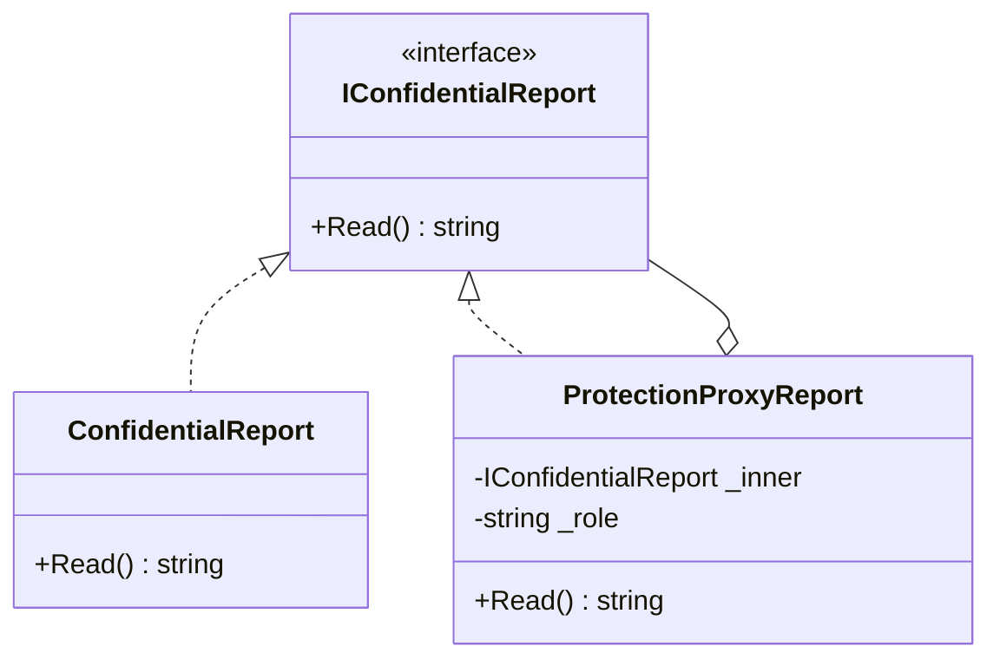

# 03 - Protection Proxy

## What this variant demonstrates

Protection Proxy controls access to the real subject. The proxy still implements the same interface, but it decides whether the caller is allowed to reach the underlying object.

### Code focus

```csharp
public interface IConfidentialReport
{
    string Read();
}

public sealed class ProtectionProxyReport : IConfidentialReport
{
    public string Read() => _role == "admin" ? _inner.Read() : "Access denied";
}
```

In this variant:
- `IConfidentialReport` is the shared abstraction for client code.
- `ProtectionProxyReport` enforces role-based access before delegating.
- `ConfidentialReport` remains free of authorization rules.

## How it differs from other proxy variants

- Compared to `01-VirtualProxy`: Protection Proxy does not delay construction; it gatekeeps access.
- Compared to `02-RemoteProxy`: Protection Proxy does not model endpoint or transport failures.
- Compared to `04-SmartProxy`: Protection Proxy does not cache or instrument calls; it only authorizes or rejects them.

## UML

