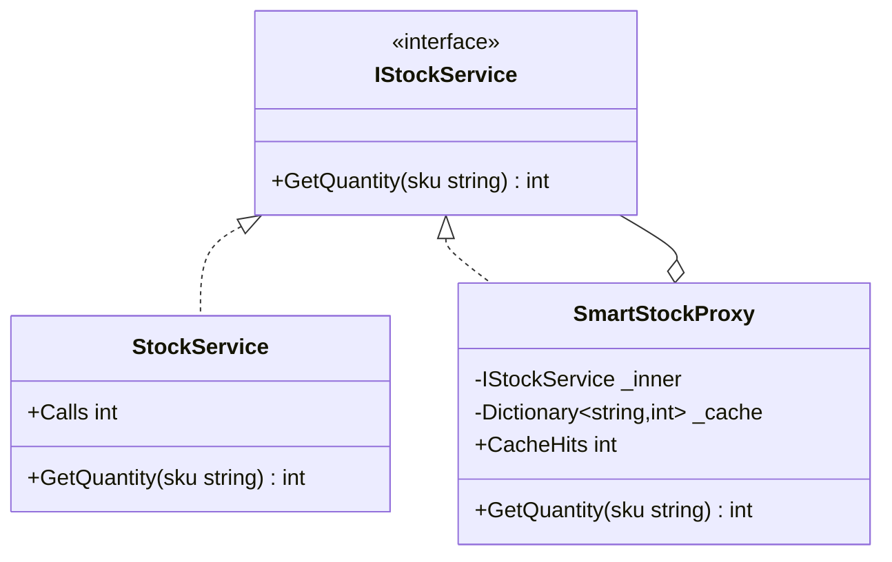

# 04 - Smart Proxy

## What this variant demonstrates

Smart Proxy adds useful behavior around the real subject, such as caching, logging, metrics, or access tracking, while preserving the subject contract.

### Code focus

```csharp
public interface IStockService
{
    int GetQuantity(string sku);
}

public sealed class SmartStockProxy : IStockService
{
    public int GetQuantity(string sku)
    {
        if (_cache.TryGetValue(sku, out var cached))
        {
            CacheHits++;
            return cached;
        }

        var qty = _inner.GetQuantity(sku);
        _cache[sku] = qty;
        return qty;
    }
}
```

In this variant:
- `IStockService` stays the client-facing contract.
- `SmartStockProxy` wraps the real subject with caching behavior.
- the proxy must not change the meaning of the returned data.

## How it differs from other proxy variants

- Compared to `01-VirtualProxy`: Smart Proxy does not focus on lazy initialization.
- Compared to `02-RemoteProxy`: Smart Proxy does not focus on transport or retry handling.
- Compared to `03-ProtectionProxy`: Smart Proxy does not block calls; it augments them.

## UML

